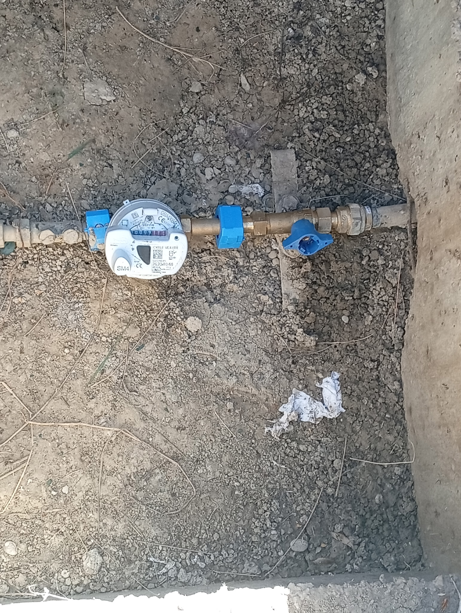
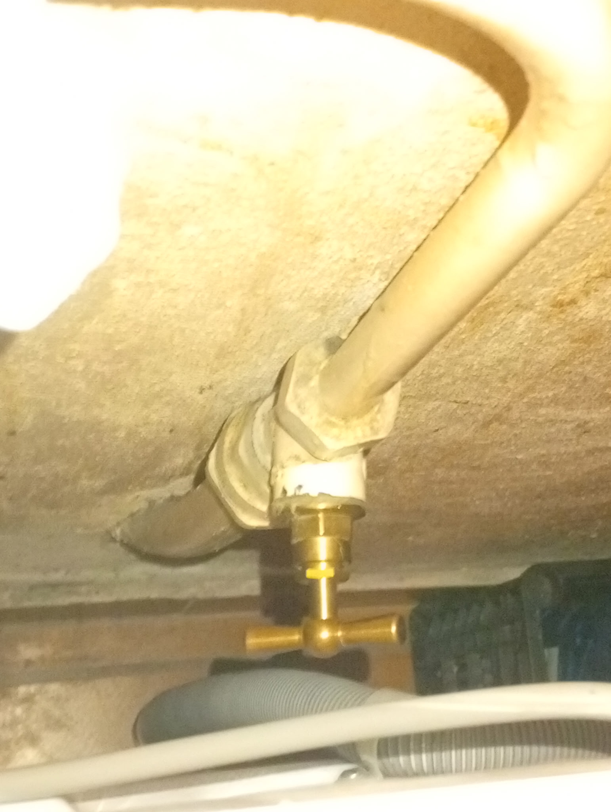
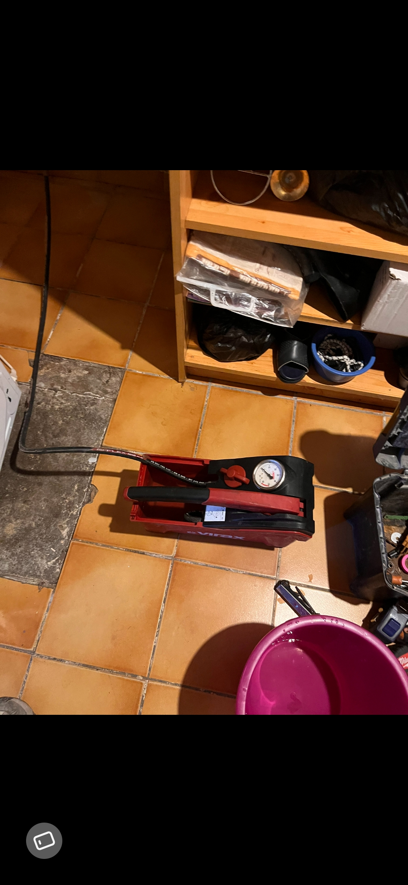
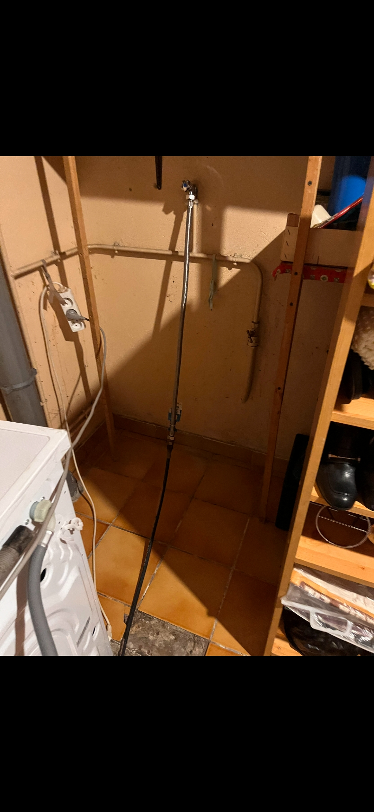
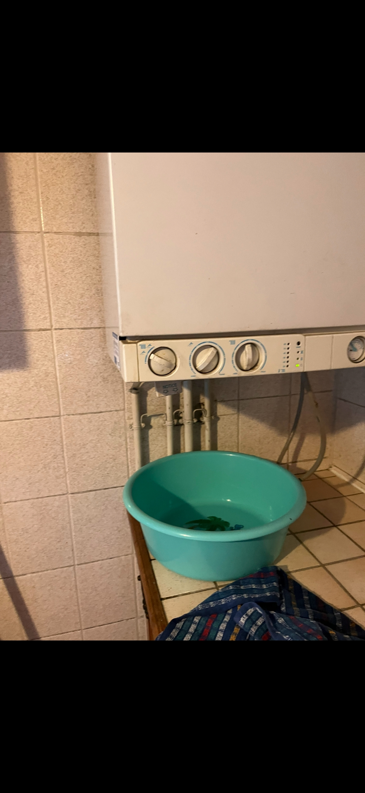

# Rapport de recherche de fuite

**Client :** Mme Ginette Laschkar
**Adresse d'intervention :** 16 allée Escadrille Normandie, Vaulx-en-Velin
**Téléphone contact :** 07 59 61 44 86
**Date de constat :** 23/09/2026
**Type d'intervention :** Recherche de fuite — constat photographique (inspection visuelle)
**Nombre de points examinés :** 5
**Résultat :** ✅ **Fuite localisée et confirmée — chaudière (point n°5)**

---

## 1. Objet de l'intervention

Ce rapport documente une inspection visuelle réalisée à partir de cinq photographies transmises en deux temps, dans le cadre d'une recherche de fuite d'eau. Il présente les observations relevées sur chaque point, leur interprétation, et les préconisations pour la suite. **La recherche a abouti à la localisation d'une fuite active au niveau de la chaudière** (point n°5).

> **Limite de méthode :** ce constat repose uniquement sur l'analyse d'images fixes. Il ne remplace pas un contrôle sur site avec les outils dédiés (test de débit au compteur, détection acoustique/géophone, caméra thermique, colorant traceur). Les préconisations de la section 4 visent à lever ces limites.

---

## 2. Point n°1 — Compteur d'eau (regard extérieur)

**Localisation :** regard/fouille en terre, à l'angle d'un mur en parpaing/béton (probablement le regard de comptage en limite de propriété).

**Éléments identifiés :**
- Compteur d'eau **Itron Cyble VC4-ITR, série SM4**, équipé d'un module de télérelève radio.
- Index visible au compteur : **≈ 0009,1xx m³** (dernier chiffre rouge non lisible avec certitude sur la photo).
- Deux vannes bleues (avant et après compteur) + un raccord/robinet de purge bleu supplémentaire en aval, sur canalisation en cuivre/laiton.
- Un raccord laiton (union) visible juste après le compteur.
- Un chiffon blanc posé au sol à environ 40 cm du raccordement aval — probablement laissé après un test d'essuyage (recherche d'humidité au contact d'un raccord).

**Observations :**
- Le fond de fouille apparaît **sec**, sans flaque ni auréole d'humidité visible autour du compteur ou des raccords, ni sur les parois de terre environnantes.
- Aucune trace de calcaire, d'oxydation ou de suintement n'est visible sur les raccords en laiton photographiés.
- Le chiffon au sol n'est pas exploitable en l'état pour conclure (pas de gros plan permettant de vérifier s'il est humide) — à vérifier sur site.

**Interprétation :** aucun indice visuel de fuite active au niveau du regard de comptage sur cette photo. Ce point ne permet cependant pas d'exclure une fuite **en aval**, sur le réseau enterré non visible, ni une micro-fuite au niveau des joints/raccords non visibles à l'objectif.

---

## 3. Point n°2 — Raccordement intérieur (traversée de mur / vanne en T)

**Localisation :** intérieur, probablement en faux-plafond ou sous meuble technique, à proximité d'un appareil raccordé par flexible (tuyau gris annelé visible en bas de cadre, type alimentation lave-linge/lave-vaisselle).

**Éléments identifiés :**
- Tube (PER ou cuivre gainé) traversant une cloison/plafond, avec manchon d'isolation visible autour du point de traversée.
- Raccord laiton en T avec **vanne de prélèvement / purge** (le petit embout fileté visible en façade), permettant vidange ou prise de pression.
- Flexible annelé gris en partie basse, cohérent avec une alimentation d'électroménager.

**Observations :**
- La photo est **surexposée et légèrement floue** (prise au flash à très courte distance), ce qui limite fortement la lecture fine des surfaces : impossible de confirmer ou d'exclure la présence d'une trace d'humidité, de calcaire ou de goutte-à-goutte au niveau du té ou du point de traversée de cloison.
- Aucune coulure ni auréole évidente n'est perceptible sur le tube ou la cloison malgré la qualité d'image limitée.
- Le point de traversée cloison/tube mériterait un contrôle tactile (recherche d'humidité au toucher) et un contrôle du joint/mastic d'étanchéité autour du manchon.

**Interprétation :** point non concluant en l'état — à recontrôler sur site dans de meilleures conditions d'éclairage, en particulier le raccord en T (point sensible classique de micro-fuite sur vanne de prélèvement) et la traversée de cloison.

---

## 4. Point n°3 — Mise en pression du réseau (matériel de test)

**Éléments identifiés :**
- Pompe de mise en pression manuelle **Virax** avec manomètre intégré, raccordée par flexible noir au réseau (probablement branchée sur la vanne de prélèvement du point n°2, ou sur un point bas du circuit).
- Le manomètre permet un test d'épreuve : mise sous pression du réseau à l'arrêt, puis surveillance de la chute de pression dans le temps — une chute anormale confirme une fuite sur le tronçon testé.
- Un seau/bac rose est visible à proximité, avec une flaque au sol sous l'appareil — cohérent avec une purge d'air ou d'eau lors de la mise en place du test.

**Interprétation :** ce matériel atteste qu'un test de pression a été engagé sur le réseau pour confirmer/isoler la fuite, en complément du test statique au compteur préconisé au point 1.

---

## 5. Point n°4 — Gaine technique (alimentation lave-linge)

**Localisation :** gaine technique murale, flexible inox raccordé en partie haute (vanne d'arrêt au plafond) et desservant un lave-linge en partie basse via une seconde vanne bleue.

**Observations :**
- Sol et parois de la gaine **secs**, aucune trace d'humidité, de calcaire ou de coulure visible le long du flexible ni au niveau des deux vannes.
- Tuyauteries cuivre visibles en applique sur le mur ne présentent pas de trace de suintement.

**Interprétation :** ce tronçon (alimentation eau du lave-linge) est **écarté** comme origine de la fuite recherchée.

---

## 6. Point n°5 — Chaudière : fuite confirmée ✅

**Localisation :** face avant/inférieure de la chaudière (murale, type chauffage + ECS), au niveau du bloc hydraulique et des raccords de tuyauteries sous l'appareil.

**Observations :**
- Une **bassine a été positionnée sous la chaudière** pour recueillir l'eau qui s'écoule des raccords situés sous l'appareil — présence d'eau visible dans la bassine.
- Les tuyauteries sous la chaudière (départ/retour chauffage, alimentation/sortie ECS, éventuellement le groupe de sécurité ou le vase d'expansion) sont la zone la plus probable de la fuite au vu de la position de la bassine.
- Cette observation, combinée aux points 1, 2 et 4 (secs, non concluants ou écartés) et au test de pression engagé (point 3), **permet de localiser la fuite au niveau de la chaudière**, et non sur le réseau de distribution enterré ou intérieur en amont.

**Interprétation :** ✅ **Fuite active confirmée sur/sous la chaudière.** Il s'agit d'une fuite sur un composant hydraulique interne à l'appareil (raccord, vanne, groupe de sécurité, vase d'expansion, échangeur ou purgeur automatique) — hors du champ d'une intervention de plomberie générale.

---

## 7. Synthèse et préconisations

| Point | Élément | Indice de fuite | Conclusion |
|---|---|---|---|
| 1 — Compteur d'eau | Regard extérieur | Aucun | Écarté |
| 2 — Raccord en T / traversée de mur | Intérieur | Non concluant (photo surexposée) | Écarté par déduction (voir point 5) |
| 3 — Mise en pression | Test de pression Virax | — | Test engagé pour isoler la fuite |
| 4 — Gaine technique lave-linge | Flexible + vannes | Aucun | Écarté (sec) |
| **5 — Chaudière** | **Bloc hydraulique / raccords sous l'appareil** | **Eau active recueillie dans une bassine** | **✅ Fuite confirmée** |

### Conclusion

La recherche de fuite est **positive et localisée au niveau de la chaudière**. Le réseau de distribution d'eau (compteur, traversées de mur, alimentation lave-linge) a été contrôlé et écarté ; la fuite provient d'un composant interne ou d'un raccord hydraulique de la chaudière elle-même.

### Préconisation

**➡️ Faire intervenir une société spécialisée en chauffage/chaudières (chauffagiste agréé, idéalement le SAV du fabricant de l'appareil).**

La réparation d'une fuite sur une chaudière (raccords hydrauliques internes, groupe de sécurité, vase d'expansion, échangeur, purgeur) relève d'une compétence spécifique en chauffagerie et peut nécessiter :
- une intervention sous garantie constructeur selon l'âge de l'appareil ;
- la dépose de pièces hydrauliques internes (hors périmètre plomberie générale) ;
- un contrôle de la pression du circuit de chauffage et un ré-équilibrage après réparation.

En attendant l'intervention :
- Laisser la bassine en place sous la chaudière pour limiter les dégâts des eaux.
- Ne pas remettre l'appareil sous pression/en chauffe au-delà du nécessaire.
- Couper l'alimentation électrique de la chaudière si le suintement s'aggrave ou s'approche de composants électriques.

---

*Rapport établi à partir de cinq photographies fournies le 23/09/2026 (2 photos initiales + 3 photos complémentaires ayant permis la localisation de la fuite). Photos jointes dans `images/`.*
